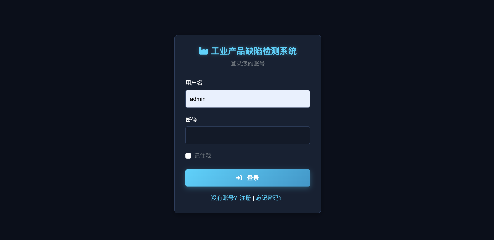
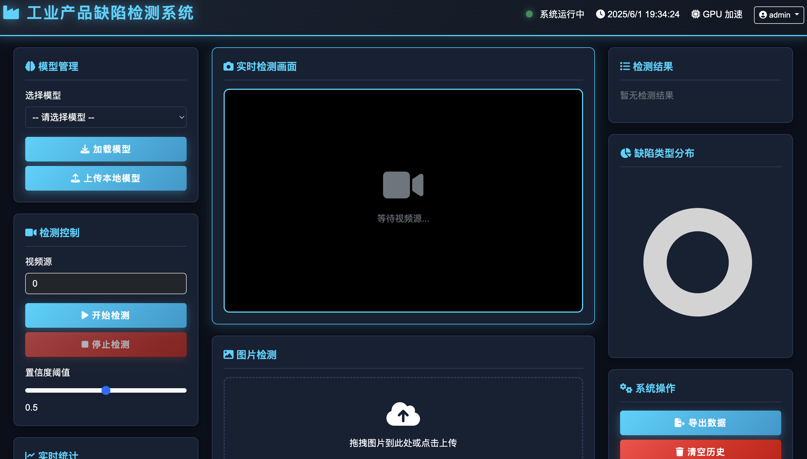

# 🏭 工业产品缺陷检测系统

<div align="center">
  
  <br>
  <em>系统界面展示</em>
</div>

## ✨ 功能特点

- 🔍 模型管理（上传、选择、加载）
- 📹 实时视频缺陷检测
- 🖼️ 图片上传检测
- 📊 缺陷类型统计
- 📥 检测结果导出
- 👥 用户管理（管理员/普通用户权限分离）
- 🤖 AI智能分析（基于DeepSeek视觉模型）
- ⚙️ 管理控制台（系统管理与数据统计）

## 🚀 快速开始

### 1. 克隆仓库

```bash
git clone <repository-url>
cd <repository-directory>
```

### 2. 创建虚拟环境（推荐）

```bash
python -m venv venv
source venv/bin/activate  # Windows: venv\Scripts\activate
```

### 3. 安装依赖

```bash
pip install -r requirements.txt
```

### 4. 运行应用

```bash
python app.py
```

访问 http://localhost:5000 开始使用

## 👥 用户管理系统

### 用户角色

#### 1. 管理员（Admin）👑
- 系统完全控制权
- 用户账户管理
- 检测模型管理
- 系统参数配置
- 检测历史和统计查看
- 管理控制台访问

#### 2. 普通用户（User）👤
- 模型检测使用
- 图片分析上传
- 个人检测历史查看

### 认证流程

1. **注册流程** 📝
   - 访问 `/register` 页面
   - 填写用户信息
   - 邮箱验证
   - 账号激活

2. **管理员指定** 👑
   - 系统初始化默认管理员
   - 管理员可提升用户权限

3. **登录认证** 🔐
   - 访问 `/login` 页面
   - 支持记住登录
   - 密码重置功能

## 📊 管理控制台

### 仪表盘
- 📈 系统数据统计
- 📊 检测数据图表
- 📉 缺陷分布图表
- 📝 活动记录

### 用户管理
- 👥 用户列表
- ➕ 添加用户
- ✏️ 编辑用户
- 🗑️ 删除用户
- 🔍 用户搜索

### 检测记录管理
- 📋 检测记录查看
- 📅 日期筛选
- 🔍 详情查看
- 🤖 AI分析

### 系统设置
- ⚙️ 检测参数配置
- 🔑 API设置
- 📧 邮件系统设置
- 💾 数据库维护

## 📁 目录结构

```
project/
├── models/     # 模型文件
├── uploads/    # 上传图片
├── results/    # 处理结果
└── database/   # 数据存储
```

## ⚠️ 注意事项

- 当前版本使用模拟检测功能
- 实际使用时需修改 `detect_defects` 函数

## 💻 系统要求

- Python 3.8+
- 推荐配置 GPU 以获得更好性能

## 🛠️ 技术栈

- 后端: Flask, OpenCV, PyTorch, SQLAlchemy
- 前端: Bootstrap, ECharts, JavaScript
- 数据库: SQLite (开发) / PostgreSQL (生产)

## 📝 许可证

MIT License

## 🤝 贡献

欢迎提交 Issue 和 Pull Request！

<div align="center">
  
  <br>
  <em>系统功能展示</em>
</div> 